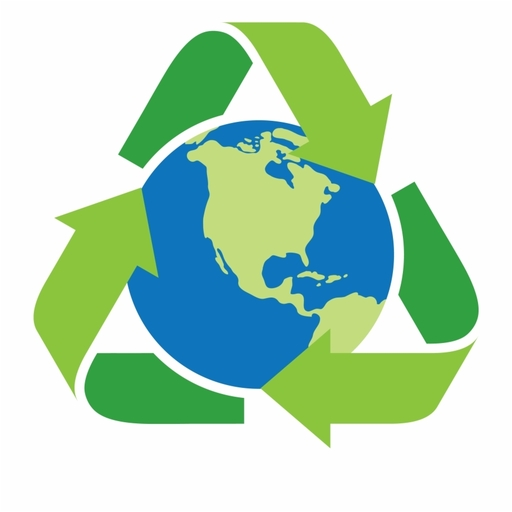

<!--
*** Thanks for checking out the Best-README-Template. If you have a suggestion
*** that would make this better, please fork the repo and create a pull request
*** or simply open an issue with the tag "enhancement".
*** Thanks again! Now go create something AMAZING! :D
-->


<!-- PROJECT SHIELDS -->
<!--
*** I'm using markdown "reference style" links for readability.
*** Reference links are enclosed in brackets [ ] instead of parentheses ( ).
*** See the bottom of this document for the declaration of the reference variables
*** for contributors-url, forks-url, etc. This is an optional, concise syntax you may use.
*** https://www.markdownguide.org/basic-syntax/#reference-style-links
-->
[![Contributors][contributors-shield]][contributors-url]
[![Forks][forks-shield]][forks-url]
[![Stargazers][stars-shield]][stars-url]
[![Issues][issues-shield]][issues-url]
[![MIT License][license-shield]][license-url]
[![LinkedIn][linkedin-shield]][linkedin-url]


<!-- PROJECT LOGO -->
<br />
<p align="center">
  <a href="https://github.com/othneildrew/Best-README-Template">
    
  </a>

  <h2 align="center">EcoCyc</h2>

  <p align="center">
    Public repository for EcoCyc, a submission for the IBM Call for Code 2021
    <br />
    <br />
    <a href="https://youtu.be/qUR4NXnaEDk">View Demo</a>
    ·
  </p>
</p>


<!-- TABLE OF CONTENTS -->
<details open="open">
  <summary>Table of Contents</summary>
  <ol>
    <li>
      <a href="#what-is-EcoCyc">What is EcoCyc</a>
    </li>
    <li>
      <a href="#short-description">Short Description</a>
      <ul>
        <li><a href="#problem">What's the problem?</a></li>
        <li><a href="#how-can-technology-help">How can technology help</a></li>
      </ul>
    </li>
    <li><a href="#demo-video">Demo Video</a></li>
    <li><a href="#solution-architecture">Solution Architecture</a></li>
    <li><a href="#contributing">Long Description</a></li>
    <li><a href="#project-roadmap">Project Roadmap</a></li>
    <li><a href="#contact">Getting Started</a></li>
    <li><a href="#acknowledgements">Acknowledgements</a></li>
  </ol>
</details>


<!-- ABOUT THE PROJECT -->
## What is EcoCyc

[![Product Name Screen Shot][product-screenshot]](https://example.com)

EcoCyc is a cross-platform app aimed at connecting people with recycling professionals, while educating them on the merits and best practices of recycling. EcoCyc allows recycling professionals to collect recyclable waste directly from users' locations. With the Covid-19 pandemic, human movements and interactions must be reduced. The user can create a collection request depending on the address and the schedule he has defined. The waste collector can then connect to the application in order to select the requests for the collections that have been created. At the request creation, the user can choose the date and time he would like the pick up to be done.

## Short Description

### What's the problem?

In Kenya and particularly in Nairobi, huge quantities of waste are endangering residents' health and their natural environment. Nairobi's seven million inhabitants produce more than 3,000 tonnes of waste a day. Lots of it ends up on the side of the road, in rivers, or is burned. 
Waste not only dominates the streetscape, but poses a threat to the environment and people's health. Due to the lacking of recycling facilities, a lot of waste is lost in nature and contributes greatly to environmental degradation. There is no platform or strategy allowing different people to connect with recycling professionals.

### How can technology help

- Connect people and recycling professionals through a mobile application that will be accessible free of charge to all.
- Encourages people to recycle by making it easier for them to manage their waste. This translates into the establishment of a pick up system where people do not have to move.
- Implementing a solution for the greatest number of people, that's why we offer a cross-platform solution (Web, Android, iOS).
- Educate people on the importance of recycling by recycling professionals through digital posts and flyers that can be shared on EcoCyc.

EcoCyc uses IBM Cloudant NoSQL database service to store all application data. Communication between Cloudant and the ionic front-end is handled using IBM's Cloud Functions service. Using the IBM cloud Service we have created the REST APIs necessary for the proper functioning of EcoCyc.


## Demo Video

[](https://youtu.be/qUR4NXnaEDk)


## Solution Architecture

<p align="center">
  
  
</p>

1.	The user interacts with EcoCyc mobile application.
2.	The Ionic app communicates with the back-end APIs.
3.	The backend API is defined in Cloud Functions APIs.
4.	Cloud Functions API forwards the request to Cloud Functions.
5.	The back end stores and retrieves information on material that is provided by users in an IBM Cloudant NoSQL database.


This is an example of how to list things you need to use the software and how to install them.
* npm
  ```sh
  npm install npm@latest -g
  ```

## Project Roadmap

<p align="center">
  
  
</p>


<!-- USAGE EXAMPLES -->
## Usage

Use this space to show useful examples of how a project can be used. Additional screenshots, code examples and demos work well in this space. You may also link to more resources.

_For more examples, please refer to the [Documentation](https://example.com)_


<!-- ROADMAP -->
## Roadmap

See the [open issues](https://github.com/othneildrew/Best-README-Template/issues) for a list of proposed features (and known issues).


<!-- CONTRIBUTING -->
## Contributing

Contributions are what make the open source community such an amazing place to be learn, inspire, and create. Any contributions you make are **greatly appreciated**.

1. Fork the Project
2. Create your Feature Branch (`git checkout -b feature/AmazingFeature`)
3. Commit your Changes (`git commit -m 'Add some AmazingFeature'`)
4. Push to the Branch (`git push origin feature/AmazingFeature`)
5. Open a Pull Request


<!-- LICENSE -->
## License

Distributed under the MIT License. See `LICENSE` for more information.


<!-- CONTACT -->
## Contact

Your Name - [@your_twitter](https://twitter.com/your_username) - email@example.com

Project Link: [https://github.com/your_username/repo_name](https://github.com/your_username/repo_name)


<!-- ACKNOWLEDGEMENTS -->
## Acknowledgements
* [GitHub Emoji Cheat Sheet](https://www.webpagefx.com/tools/emoji-cheat-sheet)
* [Img Shields](https://shields.io)
* [Choose an Open Source License](https://choosealicense.com)
* [GitHub Pages](https://pages.github.com)
* [Animate.css](https://daneden.github.io/animate.css)
* [Loaders.css](https://connoratherton.com/loaders)
* [Slick Carousel](https://kenwheeler.github.io/slick)
* [Smooth Scroll](https://github.com/cferdinandi/smooth-scroll)
* [Sticky Kit](http://leafo.net/sticky-kit)
* [JVectorMap](http://jvectormap.com)
* [Font Awesome](https://fontawesome.com)


<!-- MARKDOWN LINKS & IMAGES -->
<!-- https://www.markdownguide.org/basic-syntax/#reference-style-links -->
[contributors-shield]: https://img.shields.io/github/contributors/othneildrew/Best-README-Template.svg?style=for-the-badge
[contributors-url]: https://github.com/othneildrew/Best-README-Template/graphs/contributors
[forks-shield]: https://img.shields.io/github/forks/othneildrew/Best-README-Template.svg?style=for-the-badge
[forks-url]: https://github.com/othneildrew/Best-README-Template/network/members
[stars-shield]: https://img.shields.io/github/stars/othneildrew/Best-README-Template.svg?style=for-the-badge
[stars-url]: https://github.com/othneildrew/Best-README-Template/stargazers
[issues-shield]: https://img.shields.io/github/issues/othneildrew/Best-README-Template.svg?style=for-the-badge
[issues-url]: https://github.com/othneildrew/Best-README-Template/issues
[license-shield]: https://img.shields.io/github/license/othneildrew/Best-README-Template.svg?style=for-the-badge
[license-url]: https://github.com/othneildrew/Best-README-Template/blob/master/LICENSE.txt
[linkedin-shield]: https://img.shields.io/badge/-LinkedIn-black.svg?style=for-the-badge&logo=linkedin&colorB=555
[linkedin-url]: https://linkedin.com/in/othneildrew
[product-screenshot]: images/screenshot.png
